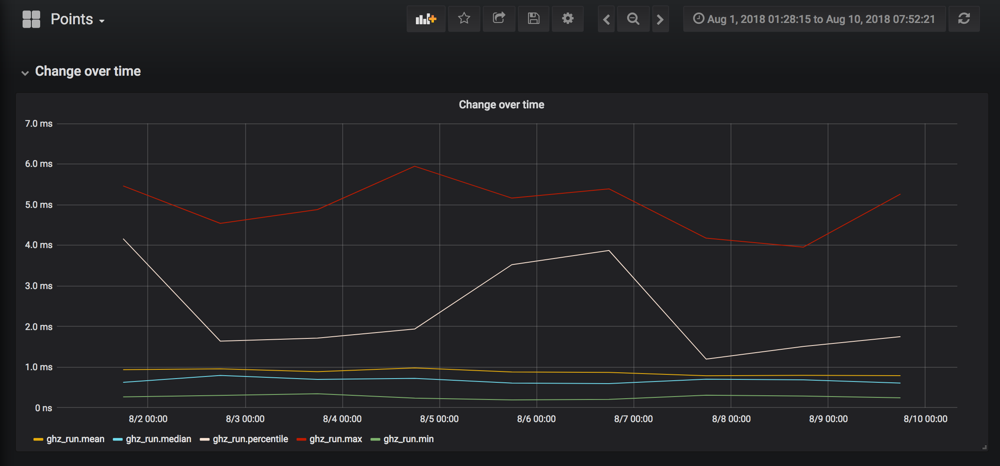

<div align="center">
	<br>
	
	<br>
</div>

# ghz

[](https://github.com/bojand/ghz/releases/latest) 
[](https://travis-ci.org/bojand/ghz)
[](https://goreportcard.com/report/github.com/bojand/ghz)
[](https://raw.githubusercontent.com/bojand/ghz/master/LICENSE)
[](https://www.paypal.me/bojandj)
[](https://www.buymeacoffee.com/bojand)

Simple [gRPC](http://grpc.io/) benchmarking and load testing tool inspired by [hey](https://github.com/rakyll/hey/) and [grpcurl](https://github.com/fullstorydev/grpcurl).

## Documentation

- [Intall](#install)
- [Usage](#usage)
- [Call Template Data](#call_template_data)
- [Examples](#examples)
- [Output](#output)
- [Extras](#extras)

<a name="install"></a>
## Install

Download a prebuilt executable binary from the [releases page](https://github.com/bojand/ghz/releases).

<a name="usage"></a>
## Usage

```
Usage: ghz [options...] <host>
Options:
  -proto	The protocol buffer file.
  -protoset	The compiled protoset file. Alternative to proto. -proto takes precedence.
  -call		A fully-qualified method name in 'service/method' or 'service.method' format.
  -cert		The file containing the CA root cert file.
  -cname	An override of the expect Server Cname presented by the server.
  -config	Path to the config JSON file
  -insecure     Specify for non TLS connection

  -c  Number of requests to run concurrently. Total number of requests cannot
      be smaller than the concurrency level. Default is 50.
  -n  Number of requests to run. Default is 200.
  -q  Rate limit, in queries per second (QPS). Default is no rate limit.
  -t  Timeout for each request in seconds. Default is 20, use 0 for infinite.
  -z  Duration of application to send requests. When duration is reached,
      application stops and exits. If duration is specified, n is ignored.
      Examples: -z 10s -z 3m.
  -x  Maximum duration of application to send requests with n setting respected.
      If duration is reached before n requests are completed, application stops and exits.
      Examples: -x 10s -x 3m.

  -d  The call data as stringified JSON.
      If the value is '@' then the request contents are read from stdin.
  -D  Path for call data JSON file. For example, /home/user/file.json or ./file.json.
  -b  The call data comes as serialized binary message read from stdin.
  -B  Path for the call data as serialized binary message.
  -m  Request metadata as stringified JSON.
  -M  Path for call metadata JSON file. For example, /home/user/metadata.json or ./metadata.json.

  -o  Output path. If none provided stdout is used.
  -O  Output type. If none provided, a summary is printed.
      "csv" outputs the response metrics in comma-separated values format.
      "json" outputs the metrics report in JSON format.
      "pretty" outputs the metrics report in pretty JSON format.
      "html" outputs the metrics report as HTML.
      "influx-summary" outputs the metrics summary as influxdb line protocol.
      "influx-details" outputs the metrics details as influxdb line protocol.

  -i  Comma separated list of proto import paths. The current working directory and the directory
	  of the protocol buffer file are automatically added to the import list.

  -T  Connection timeout in seconds for the initial connection dial. Default is 10.
  -L  Keepalive time in seconds. Only used if present and above 0.

  -name  Name of the test.

  -cpus  Number of used cpu cores. (default for current machine is 8 cores)

  -v  Print the version.
```

Alternatively all settings can be set via `ghz.json` file if present in the same path as the `ghz` executable. A custom configuration file can be specified using `-config` option.

<a name="call_template_data"></a>
## Call Template Data

Data and metadata can specify [template actions](https://golang.org/pkg/text/template/) that will be parsed and evaluated at every request. Each request gets a new instance of the data. The available variables / actions are:

```go
// call template data
type callTemplateData struct {
	RequestNumber      int64  // unique incremented request number for each request
	FullyQualifiedName string // fully-qualified name of the method call
	MethodName         string // shorter call method name
	ServiceName        string // the service name
	InputName          string // name of the input message type
	OutputName         string // name of the output message type
	IsClientStreaming  bool   // whether this call is client streaming
	IsServerStreaming  bool   // whether this call is server streaming
	Timestamp          string // timestamp of the call in RFC3339 format
	TimestampUnix      int64  // timestamp of the call as unix time
}
```

This can be useful to inject variable information into the data or metadata payload for each request, such as timestamp or unique request number. See examples below.

<a name="examples"></a>
## Examples

A simple unary call:

```sh
ghz -proto ./greeter.proto -call helloworld.Greeter.SayHello -d '{"name":"Joe"}' 0.0.0.0:50051
```

A simple unary call with metadata using template actions:

```sh
ghz -proto ./greeter.proto -call helloworld.Greeter.SayHello -d '{"name":"Joe"}' -m '{"trace_id":"{{.RequestNumber}}","timestamp":"{{.TimestampUnix}}"}' 0.0.0.0:50051
```

Using binary data file (see [writing a message](https://developers.google.com/protocol-buffers/docs/gotutorial#writing-a-message)):

```sh
ghz -proto ./greeter.proto -call helloworld.Greeter.SayHello -B ./hello_request_data.bin 0.0.0.0:50051
```

Or using binary from stdin:

```sh
ghz -proto ./greeter.proto -call helloworld.Greeter.SayHello -b 0.0.0.0:50051 < ./hello_request_data.bin
```

Custom number of requests and concurrency:

```sh
ghz -proto ./greeter.proto -call helloworld.Greeter.SayHello -d '{"name":"Joe"}' -n 2000 -c 20 0.0.0.0:50051
```

Client streaming data can be sent as an array, each element representing a single message:

```sh
ghz -proto ./greeter.proto -call helloworld.Greeter.SayHelloCS -d '[{"name":"Joe"},{"name":"Kate"},{"name":"Sara"}]' 0.0.0.0:50051
```

If a single object is given for data it is sent as every message.

We can also use `.protoset` files which can bundle multiple protocol buffer files into one binary file.

Create a protoset

```
protoc --proto_path=. --descriptor_set_out=bundle.protoset *.proto
```

And then use it as input to `ghz` with `-protoset` option:

```
./ghz -protoset ./bundle.protoset -call helloworld.Greeter.SayHello -d '{"name":"Bob"}' -n 1000 -c 10 0.0.0.0:50051
```

Note that only one of `-proto` or `-protoset` options will be used. `-proto` takes precedence.

Using a custom config file:

```sh
ghz -config ./config.json
```

Example `ghz.json`

```json
{
    "proto": "/path/to/greeter.proto",
    "call": "helloworld.Greeter.SayHello",
    "n": 2000,
    "c": 50,
    "d": {
        "name": "Joe"
    },
    "m": {
        "foo": "bar",
        "trace_id": "{{.RequestNumber}}",
        "timestamp": "{{.TimestampUnix}}"
    },
    "i": [
        "/path/to/protos"
    ],
    "x": "10s",
    "host": "0.0.0.0:50051"
}
```

<a name="output"></a>
## Output

<a name="output-summary"></a>
### Summary

Sample standard output of summary of the results:

```
Summary:
  Count:	2000
  Total:	345.52 ms
  Slowest:	15.41 ms
  Fastest:	0.66 ms
  Average:	6.83 ms
  Requests/sec:	5788.35

Response time histogram:
  0.664 [1]	|
  2.138 [36]	|∎
  3.613 [14]	|
  5.087 [65]	|∎∎
  6.561 [1305]	|∎∎∎∎∎∎∎∎∎∎∎∎∎∎∎∎∎∎∎∎∎∎∎∎∎∎∎∎∎∎∎∎∎∎∎∎∎∎∎∎
  8.035 [274]	|∎∎∎∎∎∎∎∎
  9.509 [66]	|∎∎
  10.983 [0]	|
  12.458 [59]	|∎∎
  13.932 [130]	|∎∎∎∎
  15.406 [50]	|∎∎

Latency distribution:
  10% in 5.18 ms
  25% in 5.51 ms
  50% in 6.10 ms
  75% in 6.72 ms
  90% in 12.19 ms
  95% in 13.26 ms
  99% in 14.73 ms
Status code distribution:
  [OK]	2000 responses
```

<a name="output-csv"></a>
### CSV

Alternatively with `-O csv` flag we can get detailed listing in csv format:

```sh
duration (ms),status,error
1.43,OK,
0.39,OK,
0.36,OK,
0.50,OK,
0.36,OK,
0.40,OK,
0.37,OK,
0.34,OK,
0.35,OK,
0.32,OK,
...
```

<a name="output-html"></a>
### HTML

HTML output can be generated using `html` as format in the `-O` option. See [sample output](http://bojand.github.io/sample.html).

<a name="output-json"></a>
### JSON

Using `-O json` outputs JSON data, and `-O pretty` outputs JSON in pretty format.

<a name="output-influx"></a>
### InfluxDB Line Protocol

Using `-O influx-summary` outputs the summary data as [InfluxDB Line Protocol](https://docs.influxdata.com/influxdb/v1.6/concepts/glossary/#line-protocol). Sample output:

```
ghz_run,proto="/testdata/greeter.proto",call="helloworld.Greeter.SayHello",host="0.0.0.0:50051",n=1000,c=50,qps=0,z=0,timeout=20,dial_timeout=10,keepalive=0,data="{\"name\":\"{{.InputName}}\"}",metadata="{\"rn\":\"{{.RequestNumber}}\"}",errors=74,has_errors=true count=1000,total=50000556,average=1771308,fastest=248603,slowest=7241944,rps=19999.78,median=1715940,p95=4354194,errors=74 128802790
```

Use `-O influx-details` to get the individual details for each request:

```
ghz_detail,proto="/testdata/greeter.proto",call="helloworld.Greeter.SayHello",host="0.0.0.0:50051",n=1000,c=50,qps=0,z=0,timeout=20,dial_timeout=10,keepalive=0,data="{\"name\":\"{{.InputName}}\"}",metadata="{\"rn\":\"{{.RequestNumber}}\"}",hasError=false latency=5157328,error=,status=OK 681023506
ghz_detail,proto="/testdata/greeter.proto",call="helloworld.Greeter.SayHello",host="0.0.0.0:50051",n=1000,c=50,qps=0,z=0,timeout=20,dial_timeout=10,keepalive=0,data="{\"name\":\"{{.InputName}}\"}",metadata="{\"rn\":\"{{.RequestNumber}}\"}",hasError=false latency=4990499,error=,status=OK 681029613
```

## Extras

For conveniance we include prebuilt [Grafana](http://grafana.com/) dashboards for [summary](extras/influx-summary-grafana-dashboard.json) and [details](extras/influx-details-grafana-dashboard.json).

Summary Grafana Dashboard:

<div align="center">
	<br>
	
	<br>
</div>


Details Grafana Dashboard:

<div align="center">
	<br>
	
	<br>
</div>


## Credit

Icon made by <a href="http://www.freepik.com" title="Freepik">Freepik</a> from <a href="https://www.flaticon.com/" title="Flaticon">www.flaticon.com</a> is licensed by <a href="http://creativecommons.org/licenses/by/3.0/" title="Creative Commons BY 3.0" target="_blank">CC 3.0 BY</a>

## License

Apache-2.0
