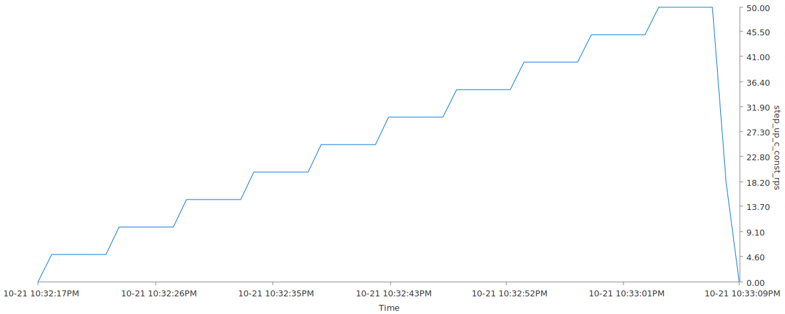

This is a walkthrough of different concurrency options available to control the number of concurrent workers that `ghz` utilizes to make requests to the server. All examples are done using a simple unary gRPC call.

Many of these options are similar to the load control options, but independently control the concurrent workers utilized.

## Step Up Concurrency

```
ghz --insecure --async --proto /protos/helloworld.proto \
  --call helloworld.Greeter/SayHello \
  -n 10000 --rps 200 \
  --concurrency-schedule=step --concurrency-start=5 --concurrency-step=5 --concurrency-end=50 --concurrency-step-duration=5s \
  -d '{"name":"{{.WorkerID}}"}' 0.0.0.0:50051

Summary:
  Count:	10000
  Total:	50.05 s
  Slowest:	52.04 ms
  Fastest:	50.19 ms
  Average:	50.59 ms
  Requests/sec:	199.79

Response time histogram:
  50.187 [1]	|
  50.373 [1786]	|∎∎∎∎∎∎∎∎∎∎∎∎∎∎∎∎∎∎∎∎∎∎∎∎
  50.558 [3032]	|∎∎∎∎∎∎∎∎∎∎∎∎∎∎∎∎∎∎∎∎∎∎∎∎∎∎∎∎∎∎∎∎∎∎∎∎∎∎∎∎
  50.743 [2822]	|∎∎∎∎∎∎∎∎∎∎∎∎∎∎∎∎∎∎∎∎∎∎∎∎∎∎∎∎∎∎∎∎∎∎∎∎∎
  50.929 [1536]	|∎∎∎∎∎∎∎∎∎∎∎∎∎∎∎∎∎∎∎∎
  51.114 [562]	|∎∎∎∎∎∎∎
  51.299 [194]	|∎∎∎
  51.485 [42]	|∎
  51.670 [15]	|
  51.855 [6]	|
  52.041 [4]	|

Latency distribution:
  10 % in 50.33 ms
  25 % in 50.42 ms
  50 % in 50.57 ms
  75 % in 50.73 ms
  90 % in 50.89 ms
  95 % in 51.01 ms
  99 % in 51.24 ms

Status code distribution:
```

This test performs a constant load at `200` RPS, starting with `5` workers, and increasing concurrency by `5` workers every `5s` until we have `50` workers. At that point all `50` workers will be used to sustain the constant `200` RPS until `10000` total request limit is reached. Worker count over time would look something like:


